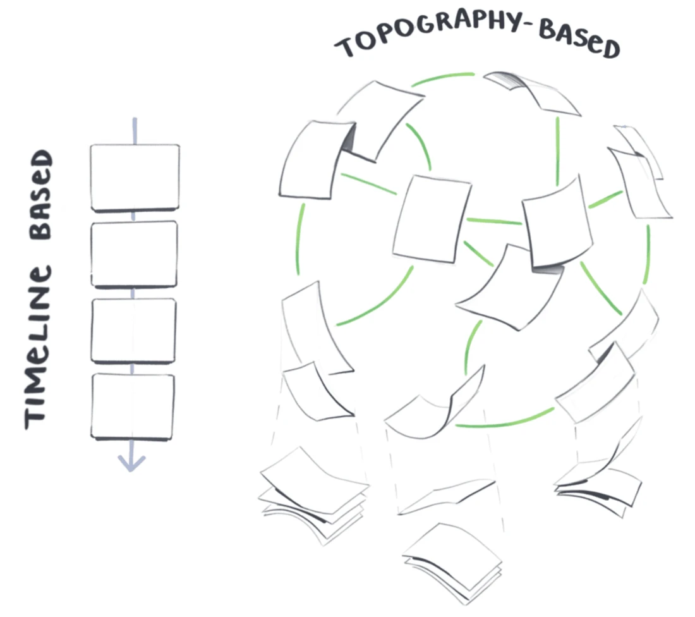
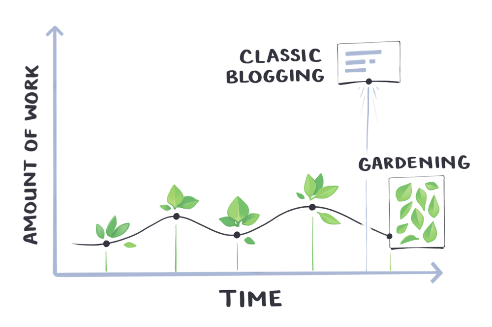
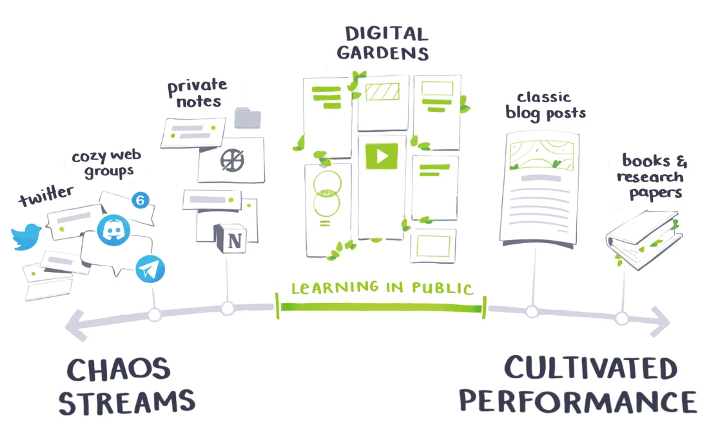

Digital Gardens is publishing personal knowledge on the web. It's a new approach, wich offers much more freedom.
Rather than presenting a set of polished articles, in reverse chrono order, act more like free form, work-in-progresse wikis.

Digital Gardens is just a collection of evolving ideas. Notes aren't strictly organised by date, the goal is to link your notes through contextual associations.
Notes:

- aren't refined or complete
- are published as half-finished thoughts that will grow and evolve over time
- are less rigid, less performative, less perfect.

Digital Gardans explore a wide variety of topics, frequently adjusted and they're here to show growth and learning. Particularly among people w/ niche interests (as a programer it's a good point).

You want to create an internet that is less about connections and feedback, we don't care about followers, more about quiet spaces. Let a person in your digital gardens wade into the unknown. Designed for delight rather than commodity.

Digital Gardens don't follow rules, you can discuss books and movies, you can share you're discover about programing, it can be an introspective journal entreis. They're not blogs, they're not a social-media platform. They can be linkied to other Digital Gardens. They can grow and change, various page on the same topic can coexist.
It's not about specific tools (wordpress, gatsby, etc), it's a different way of thinking about our online behaviour around information.
Accumulate personal knowledge over time in an explorable space, present information in a richly linked landscape that grows slowly over time.

You get to actively choose which curiosity trail to follow, rather than defaulting to the algorithmically-filtered ephemeral stream. You are in a knowledge space.

Digital Garden are not meant to be the ultimate word on a topic. Is a slower, clunkier way to explore the internet. They reveal in not being the definitive source, but just a source.

You wonder why create your Digital Garden. It's less about interactive leraning, more about public learning. As a beginer developer it's the best thing you can do to find your first job.
The content is not on Twitter, it's never deleted.
The internet (Twitter, Facebook, etc) as it stands rewards shock value and dumbing things down.
By engaging in digital gardening, you are constantly finding new connections, more depth and nuance.
When you learn more, you add to it. It's less about shock and rage, it's more connective.
In an age of doom-scrolling and zoom fatigue, digital-garden are optimistically hopeful.
Your garden is always in growth.

There is some difference w/ blogs. In blogs you're talking to a large audience, in Digital Gardens, you're talking to yourself.
You focus on what you want to cultivate over time (for learning it's a good thing, beacause that encourage you to be more selective about what you want to learn. And keep track of your learning, learning curve.)

The six patterns of gardening.

1. Topography over Timelines
   Your garden is organised around contextual relationshops and associative links. Concepts and themes within each note determine how it's connected to others, we don't care about date.
   Date might be included, but it's optional and they aren't the structural basis of how you navigate arount the garden.
   Your post are connected to other through related themes, topics, shared context (using bi directional links)

   A garden explorer can enter at any location and follow any trail they link through the content, rather most recent feed.
   But gardeners often layer on other ways of exploring: - thematic piles https://busterbenson.com/piles/ - nested folder https://tomcritchlow.com/wiki/ - tags - filtering functionality - search bar https://www.christopherbiscardi.com/garden - visual node graph https://wiki.nikiv.dev/ - central index https://maggieappleton.com/garden-history
   They can be many entry points, but no prescribed pathways.
   

2. Continuous Growth
   Gardens are never finished, they're constantly growing, evolving, and changing. This isn't how we usually think about writing on the web. There is no 'final version' on a garden. What you publish is always open to revision & expansion, designed to evolve alongside your thought.
   You post ideas while they're still 'seedlings' and tend them regularly until they're fully grown, respectable opinions

   

3. Imperfection & Learning in Public
   They're imperfect by design, don't hide their rough edged or claim to be a permanent source of truth.
   Usually putting anything imperfect and half-written on an 'official website' may feel strange, not in digital gardens.
   We've all been trained to behave like tiny, performative corporations when it comes to presenting ourselves in digital space.
   It's less performative than a blog, but more more intentional and thoughtful than a twitter feed, perfect balance of chaos and cultivation.
   It enables you to learn in public (maybe one of the most important things as beginner dev)
   Practive sharing what you learn as you're learning it, not a decade later once you're an 'expert'.

   This comes with great responsability. Publishing imperfect and early ideas requires that we make the status of our notes clear to readers.
   You should include some indicator of how 'done' they are

   - seedling: very rough and early ideas
   - budding: work cleaned up and clarified
   - evergreen: work reasonably complete (though still tend these over time)
   - date of start, and last update
   - entry could come with: - topic tags - start and end date - a stage flag: draft, in progress, finished - 1-10 importance tag
     Ask the reader to allow you to be wrong, offer constructive criticism.

   

4. Playful, Personal and Experimental
   Digital Gardens are non-homogenous by nature, you can plant the same seed as your neighbour, but you'll always end up with a different arrangement of plants. It's a personal playspace.
   You organize the garden around the ideas and mediums that match you way of thinking, rather than off someone else's standardised template.
   As a developer, gardens are a chance to question the established norms of a 'personal website', and make space for weirder, wilder experiments.

   One goal of gardens is deep contextualisation. Dumping millions of people together into decontextualised social space is a shit show. Devoid of any established social norms. Abstracted from our specific cultural identities, devoid of any established social norms. Facebook pre-selects the categories it seems important about you.

5. Intercropping & Content Diversity
   Gardens are not just a collection of interlinked words. Podcast, videos, diagrams, illustrations, web animations, academic papers, tweets, rough sketch, and code snippets should all live and grow in the garden.

6. Independent Ownership
   Gardening is about claiming a small patch of the web for yours, one you fully own and control. Should not live on the servers of Facebook, Twitter, etc. None of these are designed to help you slowly build and weave personal knowledge, most of them actively fight against it. If any of those services go under, your writing and creations sink with it.
   Owning your gardens helps you plan for long-term change, you should think about how you want your space to grow over the next few decades. Just image your garden in 10 years of learning web development.

   You can build your garden in HTML/CSS, that makes it easy to transfer and adapt your garden. Is a safe bet and beginner friendly. Backing up your notes as flat markdown files.

   Gardens are independent but we can make link between several gardens.

   In summary, benefit of gardening are several. You are free from the pressure to get everything right immediately, you can test ideas, get feedback and revise your opinions like a good internet citizen.
   It's low friction, gardening your thoughts becomes a daily ritual that only takes a small amount of effort. Over time, big things grow.
   It gives readers an insight into your writing and thinking process (very good thing for job research as a beginner).
   Gardens make their imperfection known to reader
