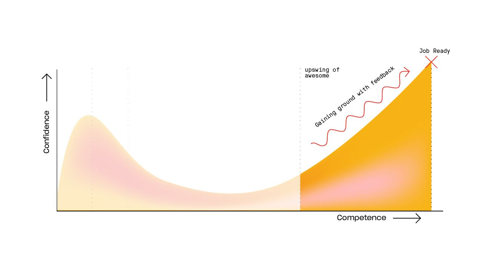

Tu es sortis du [[Le désert du désespoir|désert du désespoir]] et ta confiance en toi n'a fait que grandir. T'es compétences [Google-fu](https://english.stackexchange.com/questions/19967/what-does-google-fu-mean) sont excellentes et tu arrives maitenant à saisir les détails techniques des articles que tu lis ou vidéos. Tu es peut-être déjà aller en profondeur dans un langage particulier, ou un framework avec la confiance que tu sais maintenant construire des applications et les faire tourner. 

Tu sais faire une application, mais qu'est ce qu'il se passe sous la surface? Au début de cette phase, ton code ne sera pas très optimisé et tu ne seras pas capable de dire quelles parties de ton code sont terribles et lesquelles sont très bien.

Tu es dans un phase bi-polaire. Tu te sens à moitié développeur accompli et de l'autre côté remplit de lacunes et de faiblesses. Plus tu vas progresser plus tu auras ce [[Le syndrome de l'imposteur|sentiment d'incertitude]] à l'idée que quelqu'un te 'démasque' comme une fraude. 

Tu penses que tu devrais déjà être développeur, mais la distance entre ton code et un environnement de travail pro est encore grande. 

Tu es sortis du [[Le désert du désespoir|désert du désespoir]], [[La falaise de la confusion]], n'est plus qu'un loingtain souvenir. Tu es enfin *vraiment* sur la bonne voie. Tu apprends plus vite et plus intelligement que jamais auparavant, tu auras absorbé assez de bonnes pratiques pour que tes compétences reprèsentent un ensemble de compétences de niveau production. 

La montée en puissance de la réussite prend toujours plus de temps que prévu et semble interminable parce que tu en es si proche. Tu vas y arriver. Si tu continues d'être suffisament persévérant tu réussiras à convaincre quelqu'un de te payer POUR CONTINUER A APPRENDRE.

### Référence: 
- [[Pourquoi apprendre le code est si compliqué]]