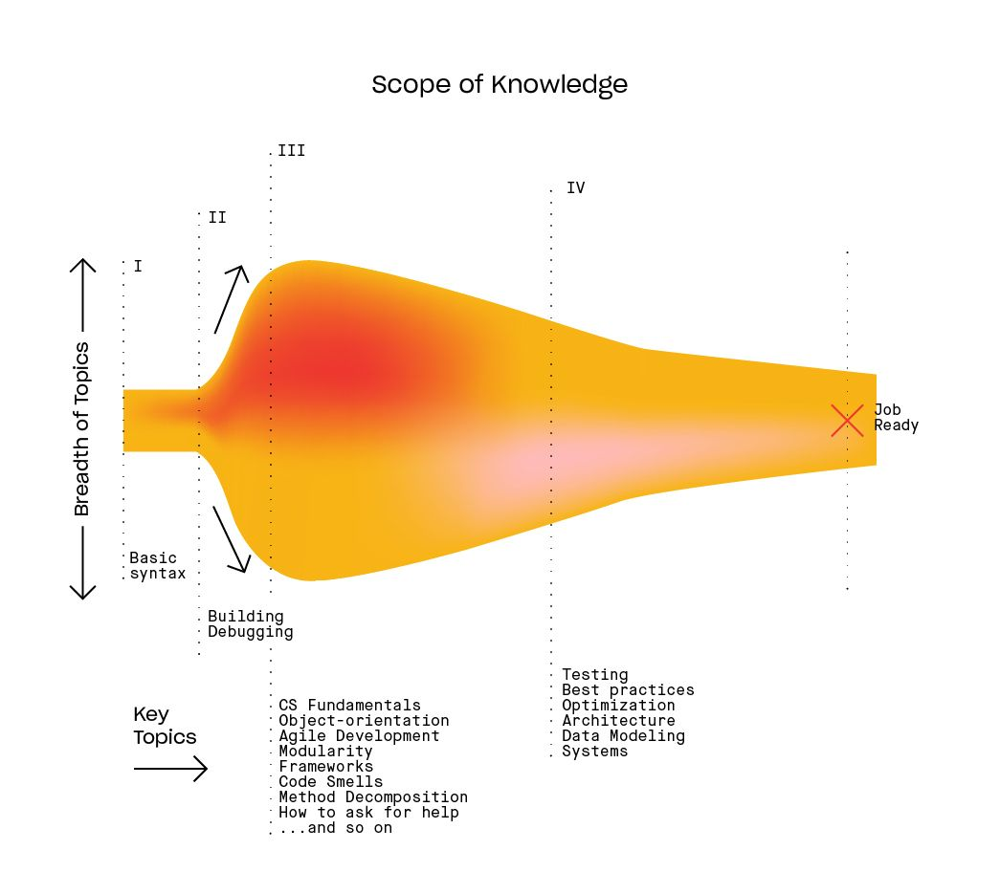

Tu es ici au pic de l'éxubérance irrationnelle. Fais attention, tu dois passer au dessus d'un précipice qui a fait renoncer énormément d'apprentit développeur et leur mettant en tête la certitude, que *"le code est trop compliqué pour moi"*.

Tu peux continuer à suivre des tutoriels mais tu ne pourras jamais sortir de cette phase sans créer à partir d'un fichier vierge. 

Bienvenu dans la seconde phase de l'apprentissage, celle où la confiance s'effondre sur terre: La falaise de la confusion. 

Donc tu commences à construire des choses par toi-même, tu te bats énormément pour avoir des choses qui fonctionnent, souvent à peine, mais il manque encore quelque chose. Tu es plus souvent en train de te battre avec le debbugage et tu as l'impression que quand tu réussi à debugger ton app que c'est uniquement grâce à une recherche Google chanceuse. Et ta confiance dans le fait que tu puisses un jour comprendre ce genre de chose s'effondre..

Cette phase arrive très rapidement, la [[La lune de miel tenu par la main|première phase]] ne dure pas si longtemps.

Une fois que tu as éliminé suffisament de bug et terminé quelques projets, c'est la fin de cette phase 2, mais tu n'en es encore qu'au début de ton long voyage.

Si tu survies à cette phase, c'est souvent à ce moment là que tu vas décider d'être all-in dans l'apprentissage du code. Et tu vas ainsi entrer dans la [[Le désert du désespoir|3ème phase]]

## Survivre à la falaise de la confusion
On doit tous connaître la falaise de la confusion, car la seule façon de devenir développeur est de développer. Tu peux toujours aller de tutoriels en tutoriels, mais tu ne feras que repousser l'inévitable. Tu risques d'entre dans le [[tutorial hell|Tutorial Hell]]. Tu devras un jour te sevrer des tutoriels et affronter le monde réel, tout seul.

1. Travail avec quelqu'un, même un débutant. Tu seras surpris de voir comment il est facile de debugger à 2.
2. Lire le code d'autre développeur pour être confortable avec les bonnes pratiques.
3. Commence petit et construit toujours. Tu dois garder ton intêret pour les gros projets pour plus tard, tu dois être à l'aise pour debugger et chercher des questions à tes réponses.

### Référence: 
- [[Pourquoi apprendre le code est si compliqué]]