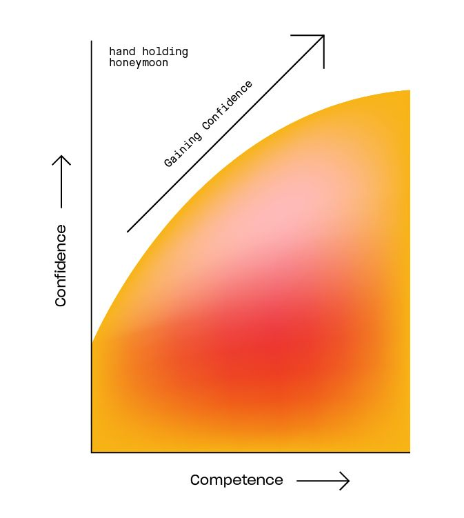

Tu vas être bien dans ta peau, car tu vas voyager à travers des ressources de qualité, réussir des choses compliqués mais qui sont réalisables, en grande partie car tu es tenu par la main. 

Tiraillé par ce que l'on peut entendre ici et là; d'un coté s'entendre dire que la programmation est trop difficile, de l'autre que le code est une opportunité fantastique et finalement pas si difficile. 

On en vient donc au moment où le problème n'est plus la peur mais l'abondance d'espoir et de grandes attentes. Et pour la plupart cela introduits des outils, ou des sites qui vont nous guider, en nous prenant par la main pour compléter différents challenges et notre confiance va augmenter. Nous allons finir par nous dire *je suis déjà développeur*.!

Ici tout est beau, mais cela l'est seulement car nous sommes tenu par la main. Avec la sensation que pas grand chose nous sépares du fait de devenir développeur, qu'on a juste quelques étapes à remplir. Mais en fait, c'est juste le commencement d'un long voyage.

### Survivre à la lune de miel

1. Il faut essayer différentes ressources pour trouver comment tu apprends le mieux, et les projets qui te plaisent. Soit ouvert d'esprit au début et ignore tout ce qui commence par *Tu devrais apprendre ça*....
2. Choisis une ressource et reste focus dessus. Va au bout de ton premier tuto, cela va te donner les premières bases de ta connaissance. Tu as besoins d'écrire des choses basiques, et ensuite tu seras prêt pour entamer le long voyage pour construire des choses par toi-même. 
