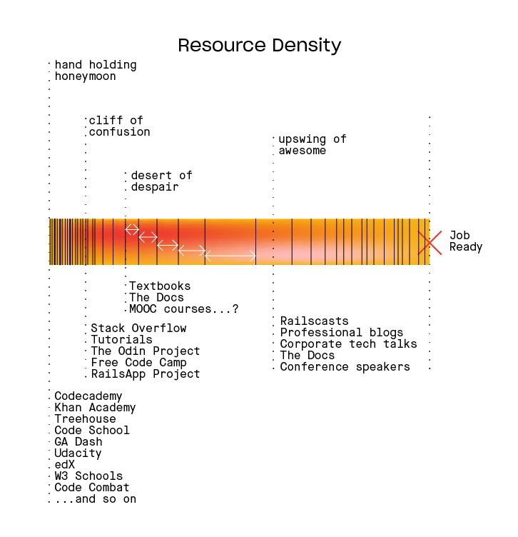
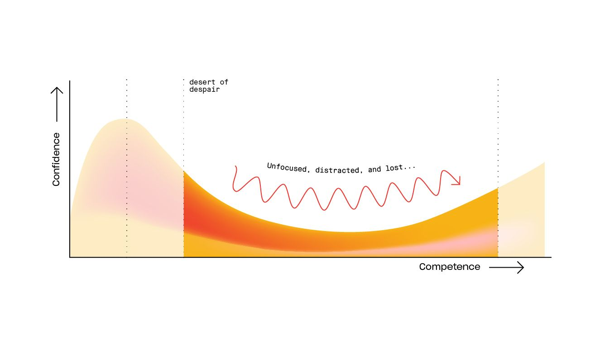

Le mélange toxique d'un champ de connaissances qui s'élargit rapidement et d'une densité de ressources qui diminuent petit à petit.

Tu sais que ce désert a une fin, mais tu ne sais pas où.

Ce désert est long, et rempli de danger. Tu peux te laisser attirer par les vendeurs de belles promesses tout au long du chemin -- des ressources tentantes qui vont te faire croire qu'ils ont la solution que tu cherches mais qui au final vont juste te déposer, une fois de plus, dans un autre endroit du désert et tu seras de nouveau perdu.

Il y a beaucoup plus à apprendre que ce que tu ne peux l'espérer. Même si dans cette phase, tu arrives à mettre en place des applications qui tournent, c'est difficile de ne pas se sentir perdu dans ce long voyage pour devenir un vrai pro. Difficile de mesurer tes progrès. Tu te demandes sans cesse si tu connais ce que tu devrais savoir ou si tu apprends les bonnes choses et il faut faire attention ici au [[Le shiny dollar syndrome|shiny dollar syndrome]].

Tu te sens perdu, jusqu'au moment où tu vas construire quelque chose qui ressemble et qui agit comme tu l'aurais espéré. Tu vas avec beaucoup de persévérance et une bonne boussole finir par lancer tes premiers 'vrais' projets et réaliser que tu commences enfin à 'comprendre'.

### Survivre au désert du désespoir

Une fois à l'aise avec le debuggage ton plus gros problème va devenir la quantité importante de connaissance requisé et une perte totale de savoir comment tout apprendre.. Le désert du désespoir. Ici tu auras juste besoin d'une solide voie à suivre.

1. Avoir un objectif fort pour ce que tu souhaites accompir, sans cela tu vas abandonner aux premières complications.
2. Trouve une solide voie à suivre qui va te guider directement jusqu'à ton but.
3. Reste concentré et évite les distractions. Quand le code devient difficile il faut que tu sois capable de continuer d'avancer, de rester concentré, focus! 