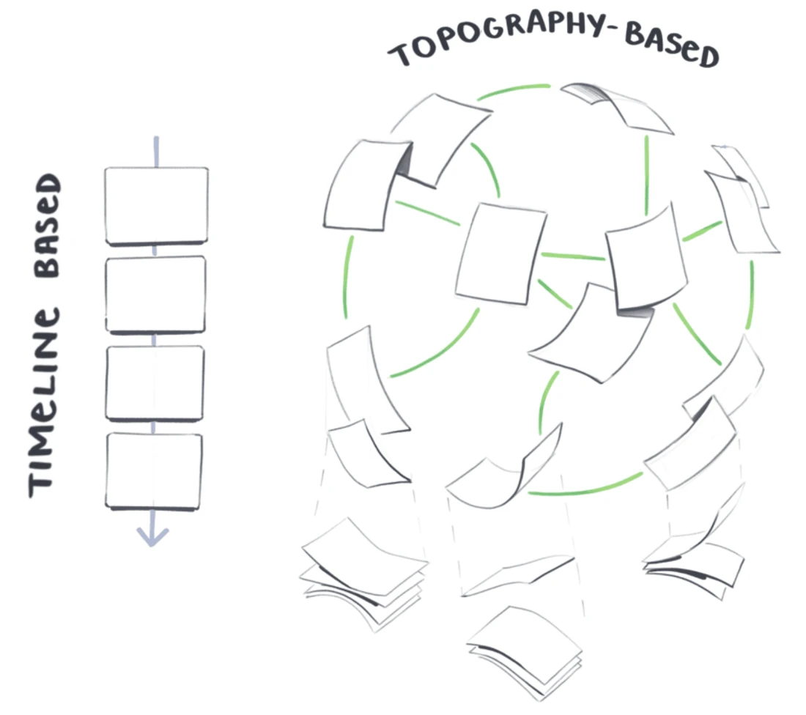

- organised around contextual relationships and associative links
- concepts and themes within each note determine how it's connected to others
	- we don't care about date
	- date migh be included but it's optional
	- they aren't the structural basis of how you navigate around the garden
- post are connected to other through
	- related themes
	- topics
	- shared context 
	- using bi directional links
- a garden explorer can enter at any location and follow any trail they link through the content, rather most recent feed
  - but gardeners often layer on other ways of exploring
	- thematic piles https://busterbenson.com/piles/
	- nested folder https://tomcritchlow.com/wiki/
	- tags
	- filtering functionality
	- search bar https://www.christopherbiscardi.com/garden
	- visual node graph https://wiki.nikiv.dev/
	- central index https://maggieappleton.com/garden-history
  - they can be many entry points, but no prescribed pathways
